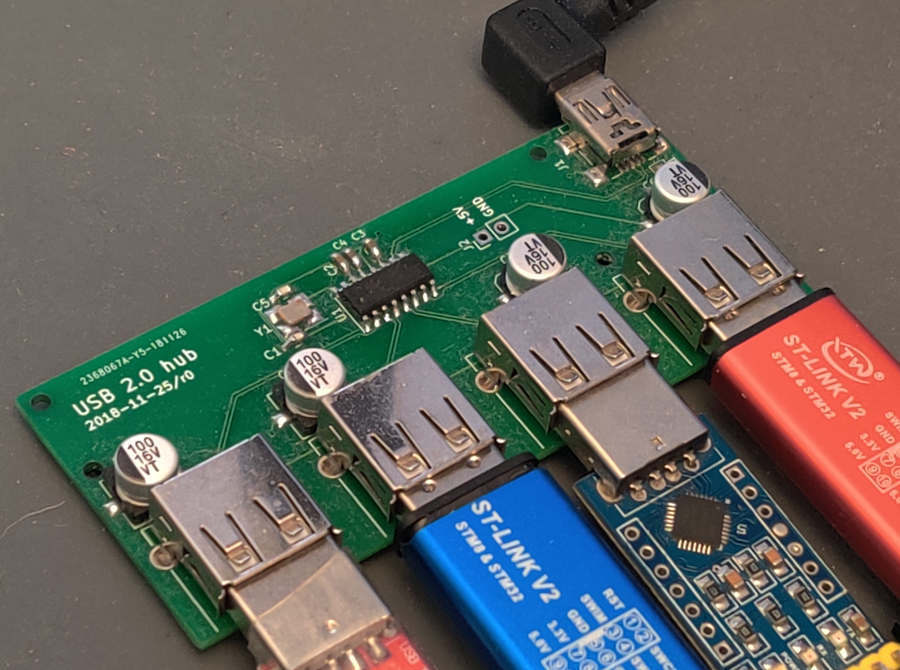

# usb-hub

A four-port USB 2.0 hub based around the [CoreChips SL2.1A](https://datasheet.lcsc.com/szlcsc/1811151645_CoreChips-SL2-1A_C192893.pdf) IC.

You can choose whether it's bus powered or externally powered with JP1. Soldering JP1 closed selects bus power, while leaving JP1 open means devices are powered with external power, which can be provided through J2.

Note that an external 12 MHz crystal is provided for the SL2.1A. The datasheet claims that the chip also has an internal 12 MHz oscillator that you can use by connecting XIN (pin 16 of the SL2.1) to ground. It's recommended to use the external one, though, as it's more stable. (see the red Chinese text on page 5 of the datasheet)

The port closest to the upstream mini-USB port is port number 1, and the remaining ports are numbered 2 through 4.

## Assembly
This board is fairly easy to assemble with a soldering iron, flux, and solder wick. The main thing to watch out for is that the two sets of electrolytic capacitors, near the output ports, have opposite polarities. The silkscreen has the positive side labeled, so you should make sure the negative side of the capacitor (with the black stripe) is opposite of the positive side (as labeled by a plus on the board).

## Useful links
* [Rev 0 schematic](./mfg/rev0/usb-hub.pdf)
* [Rev 0 BOM](./mfg/rev0/usb-hub.csv)